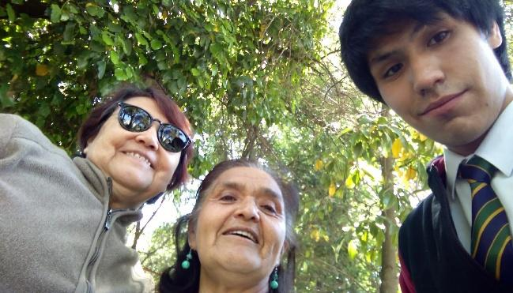

# Portafolio Digital para María Luz Lobos

He creado un portafolio digital responsivo y dinámico que incluye un carrusel de imágenes al inicio, manteniendo toda la información del documento original. El diseño es profesional y adaptado para GitHub Pages.

```html
<!DOCTYPE html>
<html lang="es">
<head>
    <meta charset="UTF-8">
    <meta name="viewport" content="width=device-width, initial-scale=1.0">
    <title>Portafolio - María Luz Lobos Lobos</title>
    <link href="https://cdn.jsdelivr.net/npm/bootstrap@5.3.0-alpha1/dist/css/bootstrap.min.css" rel="stylesheet">
    <link rel="stylesheet" href="https://cdnjs.cloudflare.com/ajax/libs/font-awesome/6.0.0/css/all.min.css">
    <style>
        :root {
            --primary-color: #4a6fa5;
            --secondary-color: #6b8cbc;
            --accent-color: #e9ecef;
            --text-color: #333;
            --light-color: #f8f9fa;
        }
        
        body {
            font-family: 'Segoe UI', Tahoma, Geneva, Verdana, sans-serif;
            color: var(--text-color);
            line-height: 1.6;
        }
        
        .navbar {
            background-color: var(--primary-color);
            box-shadow: 0 2px 4px rgba(0,0,0,0.1);
        }
        
        .navbar-brand, .nav-link {
            color: white !important;
        }
        
        .hero {
            background: linear-gradient(135deg, var(--primary-color) 0%, var(--secondary-color) 100%);
            color: white;
            padding: 80px 0;
            text-align: center;
        }
        
        .profile-img {
            width: 200px;
            height: 200px;
            border-radius: 50%;
            object-fit: cover;
            border: 5px solid white;
            margin-bottom: 20px;
        }
        
        .section-title {
            color: var(--primary-color);
            border-bottom: 2px solid var(--accent-color);
            padding-bottom: 10px;
            margin-bottom: 30px;
            position: relative;
        }
        
        .section-title::after {
            content: '';
            position: absolute;
            bottom: -2px;
            left: 0;
            width: 50px;
            height: 2px;
            background-color: var(--secondary-color);
        }
        
        .skill-card {
            background-color: var(--light-color);
            border-radius: 8px;
            padding: 20px;
            margin-bottom: 20px;
            transition: transform 0.3s;
            height: 100%;
        }
        
        .skill-card:hover {
            transform: translateY(-5px);
            box-shadow: 0 5px 15px rgba(0,0,0,0.1);
        }
        
        .skill-icon {
            font-size: 2rem;
            color: var(--primary-color);
            margin-bottom: 15px;
        }
        
        .timeline {
            position: relative;
            padding-left: 30px;
        }
        
        .timeline::before {
            content: '';
            position: absolute;
            left: 15px;
            top: 0;
            bottom: 0;
            width: 2px;
            background-color: var(--accent-color);
        }
        
        .timeline-item {
            position: relative;
            margin-bottom: 30px;
        }
        
        .timeline-item::before {
            content: '';
            position: absolute;
            left: -36px;
            top: 5px;
            width: 12px;
            height: 12px;
            border-radius: 50%;
            background-color: var(--primary-color);
            border: 3px solid white;
            box-shadow: 0 0 0 2px var(--primary-color);
        }
        
        .contact-info {
            background-color: var(--light-color);
            border-radius: 8px;
            padding: 20px;
        }
        
        .contact-icon {
            color: var(--primary-color);
            margin-right: 10px;
        }
        
        .carousel-item img {
            height: 400px;
            object-fit: cover;
        }
        
        .highlight {
            color: var(--primary-color);
            font-weight: 600;
        }
        
        footer {
            background-color: var(--primary-color);
            color: white;
            padding: 30px 0;
        }
        
        @media (max-width: 768px) {
            .hero {
                padding: 60px 0;
            }
            
            .profile-img {
                width: 150px;
                height: 150px;
            }
            
            .carousel-item img {
                height: 250px;
            }
        }
    </style>
</head>
<body>
    <!-- Navbar -->
    <nav class="navbar navbar-expand-lg navbar-dark sticky-top">
        <div class="container">
            <a class="navbar-brand" href="#">María Luz Lobos Lobos</a>
            <button class="navbar-toggler" type="button" data-bs-toggle="collapse" data-bs-target="#navbarNav">
                <span class="navbar-toggler-icon"></span>
            </button>
            <div class="collapse navbar-collapse" id="navbarNav">
                <ul class="navbar-nav ms-auto">
                    <li class="nav-item">
                        <a class="nav-link" href="#about">Acerca de mí</a>
                    </li>
                    <li class="nav-item">
                        <a class="nav-link" href="#skills">Habilidades</a>
                    </li>
                    <li class="nav-item">
                        <a class="nav-link" href="#cv">Currículum</a>
                    </li>
                    <li class="nav-item">
                        <a class="nav-link" href="#references">Referencias</a>
                    </li>
                    <li class="nav-item">
                        <a class="nav-link" href="#contact">Contacto</a>
                    </li>
                </ul>
            </div>
        </div>
    </nav>

    <!-- Hero Section with Carousel -->
    <section class="hero">
        <div class="container">
            <div id="profileCarousel" class="carousel slide" data-bs-ride="carousel">
                <div class="carousel-inner">
                    <div class="carousel-item active">
                        
                    </div>
                    <div class="carousel-item">
                        
                    </div>
                    <div class="carousel-item">
                        
                    </div>
                </div>
                <button class="carousel-control-prev" type="button" data-bs-target="#profileCarousel" data-bs-slide="prev">
                    <span class="carousel-control-prev-icon" aria-hidden="true"></span>
                    <span class="visually-hidden">Anterior</span>
                </button>
                <button class="carousel-control-next" type="button" data-bs-target="#profileCarousel" data-bs-slide="next">
                    <span class="carousel-control-next-icon" aria-hidden="true"></span>
                    <span class="visually-hidden">Siguiente</span>
                </button>
            </div>
            <h1 class="mt-4">María Luz Lobos Lobos</h1>
            <p class="lead">Psicóloga / Licenciada en Psicología</p>
            <p class="mt-3">Registro Profesionales Mineduc N°2973</p>
        </div>
    </section>

    <!-- About Section -->
    <section id="about" class="py-5">
        <div class="container">
            <h2 class="section-title">Acerca de mí</h2>
            <div class="row">
                <div class="col-lg-8 mx-auto">
                    <p>Psicóloga con experiencia en el ámbito clínico, docente y educativo, enfocada en la <span class="highlight">promoción del bienestar socioemocional, la prevención de problemáticas psicológicas y el apoyo al desarrollo integral de las personas que lo requieran, en espacios seguros de dialogo y reflexión</span>.</p>
                    
                    <p>Adicionalmente, como <span class="highlight">persona adulta mayor</span>, comprendo profundamente los desafíos, motivaciones y potencialidades que caracterizan esta etapa de la vida. Mi experiencia personal y profesional me permiten ofrecer una mirada cercana, respetuosa y positiva del envejecimiento, enfocada en el bienestar integral, la autonomía y la participación activa.</p>
                </div>
            </div>
        </div>
    </section>

    <!-- Skills Section -->
    <section id="skills" class="py-5 bg-light">
        <div class="container">
            <h2 class="section-title">Habilidades</h2>
            <div class="row">
                <div class="col-md-4">
                    <div class="skill-card">
                        <div class="skill-icon">
                            <i class="fas fa-headphones-alt"></i>
                        </div>
                        <h4>Escucha Activa y Empatía</h4>
                        <p>Durante mi trayectoria he desarrollado una sólida capacidad de escucha activa y empatía, cualidades que me permiten generar vínculos de confianza y espacios terapéuticos seguros.</p>
                    </div>
                </div>
                <div class="col-md-4">
                    <div class="skill-card">
                        <div class="skill-icon">
                            <i class="fas fa-hand-holding-heart"></i>
                        </div>
                        <h4>Responsabilidad y Compromiso Ético</h4>
                        <p>Me caracterizo por un alto nivel de responsabilidad, compromiso ético y sensibilidad social, además de una actitud flexible que me permite adaptarme a diferentes realidades y necesidades.</p>
                    </div>
                </div>
                <div class="col-md-4">
                    <div class="skill-card">
                        <div class="skill-icon">
                            <i class="fas fa-comments"></i>
                        </div>
                        <h4>Comunicación Clara y Respetuosa</h4>
                        <p>Mi estilo comunicativo claro, cercano y respetuoso me ha facilitado la intervención en distintos contextos clínicos, tanto individuales como grupales y con pacientes de diferentes edades.</p>
                    </div>
                </div>
            </div>
        </div>
    </section>

    <!-- CV Section -->
    <section id="cv" class="py-5">
        <div class="container">
            <h2 class="section-title">Currículum Vitae</h2>
            
            <div class="row mb-4">
                <div class="col-md-6">
                    <div class="contact-info">
                        <h4>Información de Contacto</h4>
                        <p><i class="fas fa-user contact-icon"></i> María Luz Lobos Lobos</p>
                        <p><i class="fas fa-phone contact-icon"></i> +56985327369</p>
                        <p><i class="fas fa-envelope contact-icon"></i> maralulalu@gmail.com</p>
                        <p><i class="fas fa-map-marker-alt contact-icon"></i> Puerto Montt</p>
                        <p><i class="fas fa-id-card contact-icon"></i> Registro Profesionales Mineduc N°2973</p>
                    </div>
                </div>
            </div>
            
            <div class="row">
                <div class="col-lg-6">
                    <h4 class="mb-3">Formación Académica</h4>
                    <div class="timeline">
                        <div class="timeline-item">
                            <h5>Título de Psicóloga / Grado de Licenciada en Psicología</h5>
                            <p>Universidad Academia de Humanismo Cristiano</p>
                        </div>
                    </div>
                    
                    <h4 class="mt-5 mb-3">Otros Cursos</h4>
                    <div class="timeline">
                        <div class="timeline-item">
                            <h5>Diplomado en Terapia de Parejas</h5>
                            <p>Universidad Academia de Humanismo Cristiano</p>
                        </div>
                        <div class="timeline-item">
                            <h5>Actualización en aplicación, corrección y reporte de la Escala Wechsler de Inteligencia para Niños</h5>
                            <p>CEDETI de la Escuela de Psicología PUC</p>
                        </div>
                        <div class="timeline-item">
                            <h5>Participación en talleres, congresos o seminarios de salud mental</h5>
                            <p>Conocimientos en intervención comunitaria y programas preventivos</p>
                        </div>
                    </div>
                </div>
                
                <div class="col-lg-6">
                    <h4 class="mb-3">Experiencia Profesional</h4>
                    <div class="timeline">
                        <div class="timeline-item">
                            <h5>Centro de Atención Psicológica de la U.A.H.C.</h5>
                        </div>
                        <div class="timeline-item">
                            <h5>Escuela de Psicología U.A.H.C.</h5>
                        </div>
                        <div class="timeline-item">
                            <h5>Colegio San Esteban de las Vizcachas / Programa de Inclusión Escolar (PIE)</h5>
                        </div>
                        <div class="timeline-item">
                            <h5>Centro de Formación Técnica UTEM</h5>
                        </div>
                        <div class="timeline-item">
                            <h5>CESFAM Padre Manuel Villaseca, Puente Alto</h5>
                        </div>
                    </div>
                </div>
            </div>
        </div>
    </section>

    <!-- References Section -->
    <section id="references" class="py-5 bg-light">
        <div class="container">
            <h2 class="section-title">Referencias</h2>
            <div class="row">
                <div class="col-md-6 mb-4">
                    <div class="card h-100">
                        <div class="card-body">
                            <h5 class="card-title">Loreto Castillo Canales</h5>
                            <p class="card-text">Directora Colegio San Esteban de las Vizcachas</p>
                            <p class="card-text"><i class="fas fa-phone contact-icon"></i> +56992320709</p>
                        </div>
                    </div>
                </div>
                <div class="col-md-6 mb-4">
                    <div class="card h-100">
                        <div class="card-body">
                            <h5 class="card-title">Carolina Miranda Muñoz</h5>
                            <p class="card-text">Coordinadora Programa Inclusión Escolar, Colegio San Esteban de las Vizcachas</p>
                            <p class="card-text"><i class="fas fa-phone contact-icon"></i> +56985714815</p>
                        </div>
                    </div>
                </div>
                <div class="col-md-6 mb-4">
                    <div class="card h-100">
                        <div class="card-body">
                            <h5 class="card-title">Carolina Bienzobas G.</h5>
                            <p class="card-text">Psicóloga, Directora y Docente de la Escuela de Psicología de la Universidad Academia de Humanismo Cristiano</p>
                            <p class="card-text"><i class="fas fa-phone contact-icon"></i> 227878200</p>
                        </div>
                    </div>
                </div>
                <div class="col-md-6 mb-4">
                    <div class="card h-100">
                        <div class="card-body">
                            <h5 class="card-title">Carolina Sepúlveda G.</h5>
                            <p class="card-text">Psicóloga, Docente de la Universidad Academia de Humanismo Cristiano</p>
                            <p class="card-text"><i class="fas fa-phone contact-icon"></i> 227878200</p>
                        </div>
                    </div>
                </div>
            </div>
        </div>
    </section>

    <!-- Contact Section -->
    <section id="contact" class="py-5">
        <div class="container">
            <h2 class="section-title">Contacto</h2>
            <div class="row">
                <div class="col-lg-8 mx-auto">
                    <div class="contact-info text-center">
                        <h4>¿Te gustaría contactarme?</h4>
                        <p class="mb-4">Puedes comunicarte conmigo a través de los siguientes medios:</p>
                        <p><i class="fas fa-phone contact-icon"></i> Teléfono: +56985327369</p>
                        <p><i class="fas fa-envelope contact-icon"></i> Email: maralulalu@gmail.com</p>
                        <p><i class="fas fa-map-marker-alt contact-icon"></i> Ciudad: Puerto Montt</p>
                    </div>
                </div>
            </div>
        </div>
    </section>

    <!-- Footer -->
    <footer class="text-center">
        <div class="container">
            <p>María Luz Lobos Lobos - Psicóloga / Licenciada en Psicología</p>
            <p>Registro Profesionales Mineduc N°2973</p>
            <p class="mb-0">&copy; 2023 - Todos los derechos reservados</p>
        </div>
    </footer>

    <script src="https://cdn.jsdelivr.net/npm/bootstrap@5.3.0-alpha1/dist/js/bootstrap.bundle.min.js"></script>
    <script>
        // Activar tooltips de Bootstrap
        var tooltipTriggerList = [].slice.call(document.querySelectorAll('[data-bs-toggle="tooltip"]'))
        var tooltipList = tooltipTriggerList.map(function (tooltipTriggerEl) {
            return new bootstrap.Tooltip(tooltipTriggerEl)
        })
        
        // Smooth scroll para los enlaces del navbar
        document.querySelectorAll('a[href^="#"]').forEach(anchor => {
            anchor.addEventListener('click', function (e) {
                e.preventDefault();
                
                const targetId = this.getAttribute('href');
                if(targetId === '#') return;
                
                const targetElement = document.querySelector(targetId);
                if(targetElement) {
                    window.scrollTo({
                        top: targetElement.offsetTop - 70,
                        behavior: 'smooth'
                    });
                }
            });
        });
    </script>
</body>
</html>
```

## Características del portafolio:

1. **Diseño responsivo** que se adapta a diferentes tamaños de pantalla
2. **Carrusel de imágenes** al inicio de la página
3. **Navegación suave** entre secciones
4. **Tarjetas interactivas** para habilidades
5. **Línea de tiempo** para mostrar experiencia y formación
6. **Secciones bien organizadas**:
   - Acerca de mí
   - Habilidades
   - Currículum (con formación y experiencia)
   - Referencias
   - Contacto

Para implementarlo en GitHub Pages:
1. Crea un nuevo repositorio en GitHub
2. Sube este archivo HTML (puedes nombrarlo `index.html`)
3. Activa GitHub Pages en la configuración del repositorio
4. El portafolio estará disponible en `https://[tu-usuario].github.io/[nombre-del-repositorio]`

Nota: Las imágenes del carrusel son marcadores de posición. Deberás reemplazarlas con las imágenes reales de María Luz Lobos.


##########################################################################################
cambio de prompt


# Estructura del Proyecto para GitHub

```
portafolio-maria-lobos/
│
├── index.html
├── README.md
├── assets/
│   ├── css/
│   │   └── style.css
│   ├── js/
│   │   └── script.js
│   └── img/
│       ├── profile.jpg
│       ├── carousel-1.jpg
│       ├── carousel-2.jpg
│       └── carousel-3.jpg
└── media/
    ├── image1.jpeg
    ├── image2.jpeg
    ├── image3.jpeg
    └── image4.jpeg
```

## Archivos necesarios:

### 1. index.html
```html
<!DOCTYPE html>
<html lang="es">
<head>
    <meta charset="UTF-8">
    <meta name="viewport" content="width=device-width, initial-scale=1.0">
    <title>Portafolio - María Luz Lobos Lobos</title>
    <link href="https://cdn.jsdelivr.net/npm/bootstrap@5.3.0-alpha1/dist/css/bootstrap.min.css" rel="stylesheet">
    <link rel="stylesheet" href="https://cdnjs.cloudflare.com/ajax/libs/font-awesome/6.0.0/css/all.min.css">
    <link rel="stylesheet" href="assets/css/style.css">
</head>
<body>
    <!-- Navbar -->
    <nav class="navbar navbar-expand-lg navbar-dark sticky-top">
        <div class="container">
            <a class="navbar-brand" href="#">María Luz Lobos Lobos</a>
            <button class="navbar-toggler" type="button" data-bs-toggle="collapse" data-bs-target="#navbarNav">
                <span class="navbar-toggler-icon"></span>
            </button>
            <div class="collapse navbar-collapse" id="navbarNav">
                <ul class="navbar-nav ms-auto">
                    <li class="nav-item">
                        <a class="nav-link" href="#about">Acerca de mí</a>
                    </li>
                    <li class="nav-item">
                        <a class="nav-link" href="#skills">Habilidades</a>
                    </li>
                    <li class="nav-item">
                        <a class="nav-link" href="#cv">Currículum</a>
                    </li>
                    <li class="nav-item">
                        <a class="nav-link" href="#references">Referencias</a>
                    </li>
                    <li class="nav-item">
                        <a class="nav-link" href="#contact">Contacto</a>
                    </li>
                </ul>
            </div>
        </div>
    </nav>

    <!-- Hero Section with Carousel -->
    <section class="hero">
        <div class="container">
            <div id="profileCarousel" class="carousel slide" data-bs-ride="carousel">
                <div class="carousel-inner">
                    <div class="carousel-item active">
                        
                    </div>
                    <div class="carousel-item">
                        
                    </div>
                    <div class="carousel-item">
                        
                    </div>
                </div>
                <button class="carousel-control-prev" type="button" data-bs-target="#profileCarousel" data-bs-slide="prev">
                    <span class="carousel-control-prev-icon" aria-hidden="true"></span>
                    <span class="visually-hidden">Anterior</span>
                </button>
                <button class="carousel-control-next" type="button" data-bs-target="#profileCarousel" data-bs-slide="next">
                    <span class="carousel-control-next-icon" aria-hidden="true"></span>
                    <span class="visually-hidden">Siguiente</span>
                </button>
            </div>
            <h1 class="mt-4">María Luz Lobos Lobos</h1>
            <p class="lead">Psicóloga / Licenciada en Psicología</p>
            <p class="mt-3">Registro Profesionales Mineduc N°2973</p>
        </div>
    </section>

    <!-- About Section -->
    <section id="about" class="py-5">
        <div class="container">
            <h2 class="section-title">Acerca de mí</h2>
            <div class="row">
                <div class="col-lg-8 mx-auto">
                    <p>Psicóloga con experiencia en el ámbito clínico, docente y educativo, enfocada en la <span class="highlight">promoción del bienestar socioemocional, la prevención de problemáticas psicológicas y el apoyo al desarrollo integral de las personas que lo requieran, en espacios seguros de dialogo y reflexión</span>.</p>
                    
                    <p>Adicionalmente, como <span class="highlight">persona adulta mayor</span>, comprendo profundamente los desafíos, motivaciones y potencialidades que caracterizan esta etapa de la vida. Mi experiencia personal y profesional me permiten ofrecer una mirada cercana, respetuosa y positiva del envejecimiento, enfocada en el bienestar integral, la autonomía y la participación activa.</p>
                </div>
            </div>
        </div>
    </section>

    <!-- Skills Section -->
    <section id="skills" class="py-5 bg-light">
        <div class="container">
            <h2 class="section-title">Habilidades</h2>
            <div class="row">
                <div class="col-md-4">
                    <div class="skill-card">
                        <div class="skill-icon">
                            <i class="fas fa-headphones-alt"></i>
                        </div>
                        <h4>Escucha Activa y Empatía</h4>
                        <p>Durante mi trayectoria he desarrollado una sólida capacidad de escucha activa y empatía, cualidades que me permiten generar vínculos de confianza y espacios terapéuticos seguros.</p>
                    </div>
                </div>
                <div class="col-md-4">
                    <div class="skill-card">
                        <div class="skill-icon">
                            <i class="fas fa-hand-holding-heart"></i>
                        </div>
                        <h4>Responsabilidad y Compromiso Ético</h4>
                        <p>Me caracterizo por un alto nivel de responsabilidad, compromiso ético y sensibilidad social, además de una actitud flexible que me permite adaptarme a diferentes realidades y necesidades.</p>
                    </div>
                </div>
                <div class="col-md-4">
                    <div class="skill-card">
                        <div class="skill-icon">
                            <i class="fas fa-comments"></i>
                        </div>
                        <h4>Comunicación Clara y Respetuosa</h4>
                        <p>Mi estilo comunicativo claro, cercano y respetuoso me ha facilitado la intervención en distintos contextos clínicos, tanto individuales como grupales y con pacientes de diferentes edades.</p>
                    </div>
                </div>
            </div>
        </div>
    </section>

    <!-- CV Section -->
    <section id="cv" class="py-5">
        <div class="container">
            <h2 class="section-title">Currículum Vitae</h2>
            
            <div class="row mb-4">
                <div class="col-md-6">
                    <div class="contact-info">
                        <h4>Información de Contacto</h4>
                        <p><i class="fas fa-user contact-icon"></i> María Luz Lobos Lobos</p>
                        <p><i class="fas fa-phone contact-icon"></i> +56985327369</p>
                        <p><i class="fas fa-envelope contact-icon"></i> maralulalu@gmail.com</p>
                        <p><i class="fas fa-map-marker-alt contact-icon"></i> Puerto Montt</p>
                        <p><i class="fas fa-id-card contact-icon"></i> Registro Profesionales Mineduc N°2973</p>
                    </div>
                </div>
            </div>
            
            <div class="row">
                <div class="col-lg-6">
                    <h4 class="mb-3">Formación Académica</h4>
                    <div class="timeline">
                        <div class="timeline-item">
                            <h5>Título de Psicóloga / Grado de Licenciada en Psicología</h5>
                            <p>Universidad Academia de Humanismo Cristiano</p>
                        </div>
                    </div>
                    
                    <h4 class="mt-5 mb-3">Otros Cursos</h4>
                    <div class="timeline">
                        <div class="timeline-item">
                            <h5>Diplomado en Terapia de Parejas</h5>
                            <p>Universidad Academia de Humanismo Cristiano</p>
                        </div>
                        <div class="timeline-item">
                            <h5>Actualización en aplicación, corrección y reporte de la Escala Wechsler de Inteligencia para Niños</h5>
                            <p>CEDETI de la Escuela de Psicología PUC</p>
                        </div>
                        <div class="timeline-item">
                            <h5>Participación en talleres, congresos o seminarios de salud mental</h5>
                            <p>Conocimientos en intervención comunitaria y programas preventivos</p>
                        </div>
                    </div>
                </div>
                
                <div class="col-lg-6">
                    <h4 class="mb-3">Experiencia Profesional</h4>
                    <div class="timeline">
                        <div class="timeline-item">
                            <h5>Centro de Atención Psicológica de la U.A.H.C.</h5>
                        </div>
                        <div class="timeline-item">
                            <h5>Escuela de Psicología U.A.H.C.</h5>
                        </div>
                        <div class="timeline-item">
                            <h5>Colegio San Esteban de las Vizcachas / Programa de Inclusión Escolar (PIE)</h5>
                        </div>
                        <div class="timeline-item">
                            <h5>Centro de Formación Técnica UTEM</h5>
                        </div>
                        <div class="timeline-item">
                            <h5>CESFAM Padre Manuel Villaseca, Puente Alto</h5>
                        </div>
                    </div>
                </div>
            </div>
        </div>
    </section>

    <!-- References Section -->
    <section id="references" class="py-5 bg-light">
        <div class="container">
            <h2 class="section-title">Referencias</h2>
            <div class="row">
                <div class="col-md-6 mb-4">
                    <div class="card h-100">
                        <div class="card-body">
                            <h5 class="card-title">Loreto Castillo Canales</h5>
                            <p class="card-text">Directora Colegio San Esteban de las Vizcachas</p>
                            <p class="card-text"><i class="fas fa-phone contact-icon"></i> +56992320709</p>
                        </div>
                    </div>
                </div>
                <div class="col-md-6 mb-4">
                    <div class="card h-100">
                        <div class="card-body">
                            <h5 class="card-title">Carolina Miranda Muñoz</h5>
                            <p class="card-text">Coordinadora Programa Inclusión Escolar, Colegio San Esteban de las Vizcachas</p>
                            <p class="card-text"><i class="fas fa-phone contact-icon"></i> +56985714815</p>
                        </div>
                    </div>
                </div>
                <div class="col-md-6 mb-4">
                    <div class="card h-100">
                        <div class="card-body">
                            <h5 class="card-title">Carolina Bienzobas G.</h5>
                            <p class="card-text">Psicóloga, Directora y Docente de la Escuela de Psicología de la Universidad Academia de Humanismo Cristiano</p>
                            <p class="card-text"><i class="fas fa-phone contact-icon"></i> 227878200</p>
                        </div>
                    </div>
                </div>
                <div class="col-md-6 mb-4">
                    <div class="card h-100">
                        <div class="card-body">
                            <h5 class="card-title">Carolina Sepúlveda G.</h5>
                            <p class="card-text">Psicóloga, Docente de la Universidad Academia de Humanismo Cristiano</p>
                            <p class="card-text"><i class="fas fa-phone contact-icon"></i> 227878200</p>
                        </div>
                    </div>
                </div>
            </div>
        </div>
    </section>

    <!-- Contact Section -->
    <section id="contact" class="py-5">
        <div class="container">
            <h2 class="section-title">Contacto</h2>
            <div class="row">
                <div class="col-lg-8 mx-auto">
                    <div class="contact-info text-center">
                        <h4>¿Te gustaría contactarme?</h4>
                        <p class="mb-4">Puedes comunicarte conmigo a través de los siguientes medios:</p>
                        <p><i class="fas fa-phone contact-icon"></i> Teléfono: +56985327369</p>
                        <p><i class="fas fa-envelope contact-icon"></i> Email: maralulalu@gmail.com</p>
                        <p><i class="fas fa-map-marker-alt contact-icon"></i> Ciudad: Puerto Montt</p>
                    </div>
                </div>
            </div>
        </div>
    </section>

    <!-- Footer -->
    <footer class="text-center">
        <div class="container">
            <p>María Luz Lobos Lobos - Psicóloga / Licenciada en Psicología</p>
            <p>Registro Profesionales Mineduc N°2973</p>
            <p class="mb-0">&copy; 2023 - Todos los derechos reservados</p>
        </div>
    </footer>

    <script src="https://cdn.jsdelivr.net/npm/bootstrap@5.3.0-alpha1/dist/js/bootstrap.bundle.min.js"></script>
    <script src="assets/js/script.js"></script>
</body>
</html>
```

### 2. assets/css/style.css
```css
:root {
    --primary-color: #4a6fa5;
    --secondary-color: #6b8cbc;
    --accent-color: #e9ecef;
    --text-color: #333;
    --light-color: #f8f9fa;
}

body {
    font-family: 'Segoe UI', Tahoma, Geneva, Verdana, sans-serif;
    color: var(--text-color);
    line-height: 1.6;
}

.navbar {
    background-color: var(--primary-color);
    box-shadow: 0 2px 4px rgba(0,0,0,0.1);
}

.navbar-brand, .nav-link {
    color: white !important;
}

.hero {
    background: linear-gradient(135deg, var(--primary-color) 0%, var(--secondary-color) 100%);
    color: white;
    padding: 80px 0;
    text-align: center;
}

.profile-img {
    width: 200px;
    height: 200px;
    border-radius: 50%;
    object-fit: cover;
    border: 5px solid white;
    margin-bottom: 20px;
}

.section-title {
    color: var(--primary-color);
    border-bottom: 2px solid var(--accent-color);
    padding-bottom: 10px;
    margin-bottom: 30px;
    position: relative;
}

.section-title::after {
    content: '';
    position: absolute;
    bottom: -2px;
    left: 0;
    width: 50px;
    height: 2px;
    background-color: var(--secondary-color);
}

.skill-card {
    background-color: var(--light-color);
    border-radius: 8px;
    padding: 20px;
    margin-bottom: 20px;
    transition: transform 0.3s;
    height: 100%;
}

.skill-card:hover {
    transform: translateY(-5px);
    box-shadow: 0 5px 15px rgba(0,0,0,0.1);
}

.skill-icon {
    font-size: 2rem;
    color: var(--primary-color);
    margin-bottom: 15px;
}

.timeline {
    position: relative;
    padding-left: 30px;
}

.timeline::before {
    content: '';
    position: absolute;
    left: 15px;
    top: 0;
    bottom: 0;
    width: 2px;
    background-color: var(--accent-color);
}

.timeline-item {
    position: relative;
    margin-bottom: 30px;
}

.timeline-item::before {
    content: '';
    position: absolute;
    left: -36px;
    top: 5px;
    width: 12px;
    height: 12px;
    border-radius: 50%;
    background-color: var(--primary-color);
    border: 3px solid white;
    box-shadow: 0 0 0 2px var(--primary-color);
}

.contact-info {
    background-color: var(--light-color);
    border-radius: 8px;
    padding: 20px;
}

.contact-icon {
    color: var(--primary-color);
    margin-right: 10px;
}

.carousel-item img {
    height: 400px;
    object-fit: cover;
}

.highlight {
    color: var(--primary-color);
    font-weight: 600;
}

footer {
    background-color: var(--primary-color);
    color: white;
    padding: 30px 0;
}

@media (max-width: 768px) {
    .hero {
        padding: 60px 0;
    }
    
    .profile-img {
        width: 150px;
        height: 150px;
    }
    
    .carousel-item img {
        height: 250px;
    }
}
```

### 3. assets/js/script.js
```javascript
// Activar tooltips de Bootstrap
var tooltipTriggerList = [].slice.call(document.querySelectorAll('[data-bs-toggle="tooltip"]'))
var tooltipList = tooltipTriggerList.map(function (tooltipTriggerEl) {
    return new bootstrap.Tooltip(tooltipTriggerEl)
})

// Smooth scroll para los enlaces del navbar
document.querySelectorAll('a[href^="#"]').forEach(anchor => {
    anchor.addEventListener('click', function (e) {
        e.preventDefault();
        
        const targetId = this.getAttribute('href');
        if(targetId === '#') return;
        
        const targetElement = document.querySelector(targetId);
        if(targetElement) {
            window.scrollTo({
                top: targetElement.offsetTop - 70,
                behavior: 'smooth'
            });
        }
    });
});

// Efecto de aparición al hacer scroll
const observerOptions = {
    threshold: 0.1,
    rootMargin: '0px 0px -50px 0px'
};

const observer = new IntersectionObserver((entries) => {
    entries.forEach(entry => {
        if (entry.isIntersecting) {
            entry.target.style.opacity = '1';
            entry.target.style.transform = 'translateY(0)';
        }
    });
}, observerOptions);

// Aplicar a elementos que queremos animar
document.addEventListener('DOMContentLoaded', function() {
    const animatedElements = document.querySelectorAll('.skill-card, .timeline-item, .card');
    
    animatedElements.forEach(el => {
        el.style.opacity = '0';
        el.style.transform = 'translateY(20px)';
        el.style.transition = 'opacity 0.6s ease, transform 0.6s ease';
        observer.observe(el);
    });
});
```

### 4. README.md
```markdown
# Portafolio Digital - María Luz Lobos Lobos

Portafolio profesional de María Luz Lobos Lobos, Psicóloga Licenciada.

## Características

- Diseño responsivo
- Carrusel de imágenes
- Navegación suave
- Animaciones al hacer scroll
- Secciones organizadas:
  - Acerca de mí
  - Habilidades
  - Currículum
  - Referencias
  - Contacto

## Tecnologías utilizadas

- HTML5
- CSS3
- JavaScript
- Bootstrap 5
- Font Awesome

## Instalación

1. Clonar el repositorio
2. Abrir `index.html` en un navegador web

## Estructura del proyecto

```
portafolio-maria-lobos/
├── index.html
├── README.md
├── assets/
│   ├── css/
│   │   └── style.css
│   ├── js/
│   │   └── script.js
│   └── img/
└── media/
```

## Licencia

Todos los derechos reservados - 2023
```

## Para implementar en GitHub:

1. Crea un nuevo repositorio llamado `portafolio-maria-lobos`
2. Sube todos los archivos y carpetas manteniendo la estructura
3. En la configuración del repositorio, ve a "Pages" y selecciona la rama main
4. El sitio estará disponible en: `https://[tu-usuario].github.io/portafolio-maria-lobos`

**Nota importante:** Recuerda reemplazar las imágenes de placeholder en la carpeta `assets/img/` con las imágenes reales de María Luz Lobos.